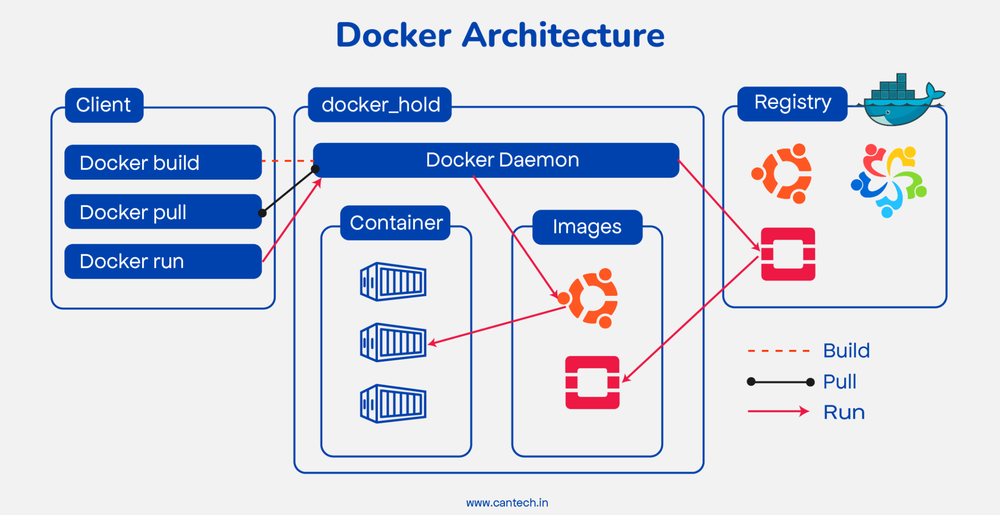
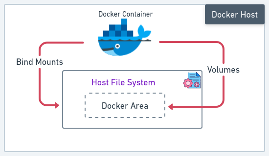

# Docker Learning Concepts - Revision Guide

---

## Docker

Docker is a platform for developing, shipping, and running applications inside lightweight, isolated environments called containers. It packages an application and its dependencies together, ensuring consistency across development, testing, and production environments.

Key benefits:
- Consistent environments across the software lifecycle
- Lightweight compared to virtual machines (shares host OS kernel)
- Fast startup times (seconds vs minutes for VMs)
- Microservices-friendly architecture
- Version-controlled infrastructure via Dockerfiles

---

## Dockerfile

A Dockerfile is a text file containing sequential instructions to build a Docker image. Each instruction creates a layer in the image.

### Example 1: Simple Python Dockerfile

A minimal Dockerfile for beginners — runs a basic Python script or Flask app with no extra complexity.

```dockerfile
# Start from an official Python base image
FROM python:3.11

# Set the working directory inside the container
WORKDIR /app

# Copy all files from current directory to /app in container
COPY . .

# Install dependencies from requirements.txt
RUN pip install -r requirements.txt

# Tell Docker this container listens on port 5000
EXPOSE 5000

# Run the application when the container starts
CMD ["python", "app.py"]
```

**What this does step by step:**
1. Pulls Python 3.11 (full image, ~900MB — fine for learning)
2. Sets `/app` as the working directory
3. Copies your project files into the container
4. Installs Python packages
5. Runs `app.py` when the container starts

```bash
# Build and run
docker build -t my-python-app .
docker run -p 5000:5000 my-python-app
```

---

### Example 2: Production-Ready Python Dockerfile

A hardened Dockerfile following best practices — slim base, layer caching, non-root user, environment tuning.

```dockerfile
# Base image - use slim variant for smaller size (~150MB vs ~900MB)
FROM python:3.11-slim

# Set metadata labels
LABEL maintainer="developer@example.com"
LABEL description="Production Python web application"

# Prevents Python from writing .pyc bytecode files to disk
ENV PYTHONDONTWRITEBYTECODE=1
# Prevents Python from buffering stdout/stderr (logs appear immediately)
ENV PYTHONUNBUFFERED=1

# Set working directory inside the container
WORKDIR /app

# Copy ONLY the dependency file first
# This leverages Docker layer caching — dependencies are only reinstalled
# when requirements.txt changes, not on every code change
COPY requirements.txt .

# Install dependencies with no cache to keep image small
RUN pip install --no-cache-dir -r requirements.txt

# Now copy the rest of the application code
# This layer rebuilds on every code change, but layers above stay cached
COPY . .

# Expose the port the app runs on (documentation only, doesn't publish)
EXPOSE 8000

# Create a non-root user for security
# Running as root inside containers is a security risk
RUN adduser --disabled-password --gecos '' appuser
USER appuser

# Command to run the application
CMD ["python", "app.py"]
```

**Key differences from the simple version:**

| Feature | Simple | Production-Ready |
|---------|--------|-----------------|
| Base image | `python:3.11` (~900MB) | `python:3.11-slim` (~150MB) |
| Layer caching | No (COPY all first) | Yes (requirements.txt copied separately) |
| Non-root user | No (runs as root) | Yes (appuser) |
| .pyc files | Generated | Disabled |
| Log buffering | Buffered | Unbuffered (real-time logs) |
| pip cache | Kept | Removed (`--no-cache-dir`) |

### Common Dockerfile Instructions

| Instruction | Purpose |
|-------------|---------|
| `FROM` | Sets the base image |
| `RUN` | Executes commands during build |
| `COPY` | Copies files from host to image |
| `ADD` | Like COPY but supports URLs and tar extraction |
| `WORKDIR` | Sets working directory |
| `ENV` | Sets environment variables |
| `EXPOSE` | Documents which port the container listens on |
| `USER` | Sets the user for subsequent instructions |
| `ARG` | Defines build-time variables |
| `VOLUME` | Creates a mount point |
| `CMD` | Default command when container starts |
| `ENTRYPOINT` | Configures container as an executable |

---

## Docker Image Concepts

A Docker image is a read-only template containing instructions for creating a container. It consists of stacked layers, each representing a Dockerfile instruction.

**Key characteristics:**
- Immutable once built
- Composed of multiple layers (union file system)
- Each layer is cached and reusable
- Identified by repository name, tag, and SHA256 digest
- Stored in registries (Docker Hub, ECR, GCR)

**Layer caching:** Docker caches each layer. If a layer hasn't changed, Docker reuses the cached version. This is why you copy `requirements.txt` before copying application code — dependency installation is cached until requirements change.

```
Layer 4: COPY . .              (application code)
Layer 3: RUN pip install ...   (dependencies)
Layer 2: COPY requirements.txt (dependency file)
Layer 1: FROM python:3.11-slim (base OS + Python)
```

**Image tagging:**
```bash
docker build -t myapp:1.0 .
docker tag myapp:1.0 myapp:latest
```

---

## Docker Container Concepts

A container is a running instance of a Docker image. It adds a writable layer on top of the image's read-only layers.

**Key characteristics:**
- Isolated process(es) running on the host
- Has its own filesystem, networking, and process space
- Ephemeral by default (data lost when container is removed)
- Can be started, stopped, restarted, and removed
- Shares the host OS kernel (not a full VM)

**Container lifecycle:**
```
Created → Running → Paused → Stopped → Removed
```

**Container vs Image:**
| Image | Container |
|-------|-----------|
| Blueprint/template | Running instance |
| Read-only | Read-write layer on top |
| Built from Dockerfile | Created from image |
| Stored in registry | Runs on Docker host |
| Can create many containers | One specific instance |

---

## Docker Architecture Concepts

Docker uses a client-server architecture with three main components:



**Components:**

1. **Docker Client** — The interface where users run commands like `docker build`, `docker pull`, and `docker run`. It communicates with the Docker Daemon via REST API.
2. **Docker Host** — The machine running the Docker Daemon, which manages:
   - **Docker Daemon** — The background process that listens for client requests and manages Docker objects
   - **Containers** — Running instances created from images (shown as container icons)
   - **Images** — Read-only templates used to create containers (pulled from registry or built locally)
3. **Docker Registry** — A remote storage for Docker images (e.g., Docker Hub). The daemon pulls images from here and can push images to it.

**How the three components interact:**

| Operation | Flow |
|-----------|------|
| `docker build` | Client → Daemon builds an image locally (dashed line) |
| `docker pull` | Client → Daemon → Registry fetches an image (black line) |
| `docker run` | Client → Daemon creates a container from an image; if image not local, pulls from Registry first (red line) |

---

## CMD vs ENTRYPOINT

Both define what runs when a container starts, but they behave differently.

### CMD

- Provides default command and/or arguments
- Easily overridden by passing arguments to `docker run`
- If Dockerfile has multiple CMD instructions, only the last one takes effect

```dockerfile
CMD ["python", "app.py"]
```

```bash
# Uses CMD - runs python app.py
docker run myapp

# Overrides CMD entirely - runs bash instead
docker run myapp bash
```

### ENTRYPOINT

- Configures the container to run as an executable
- NOT easily overridden (requires `--entrypoint` flag)
- Arguments passed to `docker run` are appended to ENTRYPOINT

```dockerfile
ENTRYPOINT ["python", "app.py"]
```

```bash
# Runs: python app.py
docker run myapp

# Runs: python app.py --debug (appends to ENTRYPOINT)
docker run myapp --debug
```

### Combined Usage (Best Practice)

Use ENTRYPOINT for the fixed executable and CMD for default arguments:

```dockerfile
ENTRYPOINT ["python", "app.py"]
CMD ["--port", "8000"]
```

```bash
# Runs: python app.py --port 8000 (uses default CMD)
docker run myapp

# Runs: python app.py --port 9000 (overrides CMD only)
docker run myapp --port 9000
```

### Comparison Table

| Feature | CMD | ENTRYPOINT |
|---------|-----|------------|
| Purpose | Default command/args | Fixed executable |
| Override | `docker run <image> <cmd>` | `docker run --entrypoint <cmd>` |
| Shell form | `CMD command param1` | `ENTRYPOINT command param1` |
| Exec form | `CMD ["cmd", "param1"]` | `ENTRYPOINT ["cmd", "param1"]` |
| Combined | Provides default args to ENTRYPOINT | Receives CMD as arguments |

---

## Docker Multistage Build

Multistage builds use multiple `FROM` statements to create intermediate build stages. The final image only contains what you explicitly copy from previous stages, resulting in much smaller production images.

**Benefits:**
- Dramatically smaller final images (no build tools, source code, or intermediate artifacts)
- Single Dockerfile for build and runtime
- Better security (fewer packages = smaller attack surface)
- Faster deployments (smaller images to transfer)

### Node.js Example

```dockerfile
# ============ Stage 1: Build ============
FROM node:20-alpine AS builder

WORKDIR /app

# Install dependencies
COPY package.json package-lock.json ./
RUN npm ci

# Copy source and build
COPY . .
RUN npm run build

# ============ Stage 2: Production ============
FROM node:20-alpine AS production

WORKDIR /app

# Only copy production dependencies
COPY package.json package-lock.json ./
RUN npm ci --only=production && npm cache clean --force

# Copy built artifacts from builder stage
COPY --from=builder /app/dist ./dist

# Non-root user
RUN addgroup -S appgroup && adduser -S appuser -G appgroup
USER appuser

EXPOSE 3000
CMD ["node", "dist/index.js"]
```

**Result:** Build stage might be ~900MB (Node + dev dependencies + source), but final image is ~150MB (Node + production dependencies + compiled output only).

### Python Example

```dockerfile
# ============ Stage 1: Build ============
FROM python:3.11-slim AS builder

WORKDIR /app

# Install build dependencies
RUN apt-get update && apt-get install -y --no-install-recommends \
    gcc \
    libpq-dev \
    && rm -rf /var/lib/apt/lists/*

# Create virtual environment and install dependencies
RUN python -m venv /opt/venv
ENV PATH="/opt/venv/bin:$PATH"

COPY requirements.txt .
RUN pip install --no-cache-dir -r requirements.txt

# ============ Stage 2: Production ============
FROM python:3.11-slim AS production

WORKDIR /app

# Install only runtime libraries (not build tools)
RUN apt-get update && apt-get install -y --no-install-recommends \
    libpq5 \
    && rm -rf /var/lib/apt/lists/*

# Copy virtual environment from builder
COPY --from=builder /opt/venv /opt/venv
ENV PATH="/opt/venv/bin:$PATH"

# Copy application code
COPY . .

# Non-root user
RUN adduser --disabled-password --gecos '' appuser
USER appuser

EXPOSE 8000
CMD ["gunicorn", "app:create_app()", "--bind", "0.0.0.0:8000", "--workers", "4"]
```

**Result:** No gcc, no build headers, no pip cache in the final image. Only the compiled Python packages and runtime libraries.

---

## Docker Networks

Docker networking allows containers to communicate with each other and the outside world. Docker creates and manages networks that containers attach to.

### Network Drivers

| Driver | Description | Use Case |
|--------|-------------|----------|
| `bridge` | Default. Isolated network on the host | Single-host container communication |
| `host` | Removes network isolation; shares host network | Performance-sensitive applications |
| `none` | No networking | Completely isolated containers |
| `overlay` | Spans multiple Docker hosts | Docker Swarm / multi-host |
| `macvlan` | Assigns MAC address; appears as physical device | Legacy apps needing direct network access |

### Default Bridge Network Example

```bash
# Create a custom bridge network
docker network create mynetwork

# Run containers on the same network
docker run -d --name webapp --network mynetwork nginx:alpine
docker run -d --name database --network mynetwork postgres:15

# Containers can reach each other by name
docker exec webapp ping database    # works!
docker exec database ping webapp    # works!

# Inspect the network
docker network inspect mynetwork
```

**Default bridge vs Custom bridge:**

| Feature | Default bridge | Custom bridge |
|---------|---------------|---------------|
| DNS resolution | No (use --link, deprecated) | Yes (automatic by container name) |
| Isolation | All containers on same default bridge | Only containers on same custom network |

```bash
# Connect a running container to another network
docker network connect mynetwork existing-container

# Disconnect
docker network disconnect mynetwork existing-container
```

### Port Mapping

```bash
# Map host port 8080 to container port 80
docker run -p 8080:80 nginx

# Map to specific host interface
docker run -p 127.0.0.1:8080:80 nginx

# Random host port
docker run -p 80 nginx
```

---

## Docker Storage Types




Docker provides three main ways to persist data beyond the container lifecycle.

### 1. Volumes (Recommended)

Managed by Docker. Stored in `/var/lib/docker/volumes/` on the host. Best for persistent data.

```bash
# Create a named volume
docker volume create app-data

# Use the volume
docker run -d \
  --name postgres-db \
  -v app-data:/var/lib/postgresql/data \
  postgres:15

# List volumes
docker volume ls

# Inspect a volume
docker volume inspect app-data

# Remove unused volumes
docker volume prune
```

### 2. Bind Mounts

Maps a specific host path into the container. Good for development (live code reload).

```bash
# Mount current directory into container
docker run -d \
  --name dev-app \
  -v $(pwd)/src:/app/src \
  -v $(pwd)/config.yaml:/app/config.yaml:ro \
  myapp:dev

# Read-only bind mount (`:ro` flag)
docker run -v /host/path:/container/path:ro nginx
```

### 3. tmpfs Mounts

Stored in host memory only. Never written to host filesystem. Data lost when container stops.

```bash
# Use tmpfs for sensitive data
docker run -d \
  --name secure-app \
  --tmpfs /app/tmp:rw,size=100m \
  myapp:latest
```

### Comparison

| Feature | Volumes | Bind Mounts | tmpfs |
|---------|---------|-------------|-------|
| Location | Docker-managed | Host filesystem | Host memory |
| Persistence | Yes | Yes | No (container lifecycle) |
| Performance | Good | Good | Fastest |
| Portability | High | Low (host-path dependent) | N/A |
| Backup | `docker volume` commands | Standard file tools | Not applicable |
| Use case | Production data | Development, configs | Secrets, temp data |

---

## Docker Compose

Docker Compose is a tool for defining and running multi-container applications. You define services, networks, and volumes in a single YAML file.

### Structure

```yaml
# Top-level elements
services:    # Container definitions
networks:    # Custom networks
volumes:     # Named volumes
configs:     # Configuration files
secrets:     # Sensitive data
```

### Full Example

```yaml
services:
  # Web application
  web:
    build:
      context: ./app
      dockerfile: Dockerfile
    ports:
      - "8000:8000"
    environment:
      - DATABASE_URL=postgresql://user:pass@db:5432/mydb
      - REDIS_URL=redis://cache:6379/0
    volumes:
      - ./app:/code           # Bind mount for development
      - static-files:/code/static  # Named volume
    depends_on:
      db:
        condition: service_healthy
      cache:
        condition: service_started
    networks:
      - frontend
      - backend
    restart: unless-stopped
    healthcheck:
      test: ["CMD", "curl", "-f", "http://localhost:8000/health"]
      interval: 30s
      timeout: 10s
      retries: 3
      start_period: 40s

  # PostgreSQL database
  db:
    image: postgres:15-alpine
    environment:
      POSTGRES_USER: user
      POSTGRES_PASSWORD: pass
      POSTGRES_DB: mydb
    volumes:
      - db-data:/var/lib/postgresql/data
      - ./init.sql:/docker-entrypoint-initdb.d/init.sql
    ports:
      - "5432:5432"
    networks:
      - backend
    healthcheck:
      test: ["CMD-SHELL", "pg_isready -U user -d mydb"]
      interval: 10s
      timeout: 5s
      retries: 5

  # Redis cache
  cache:
    image: redis:7-alpine
    command: redis-server --maxmemory 256mb --maxmemory-policy allkeys-lru
    ports:
      - "6379:6379"
    volumes:
      - cache-data:/data
    networks:
      - backend

  # Nginx reverse proxy
  nginx:
    image: nginx:alpine
    ports:
      - "80:80"
      - "443:443"
    volumes:
      - ./nginx/nginx.conf:/etc/nginx/nginx.conf:ro
      - static-files:/usr/share/nginx/html/static:ro
    depends_on:
      - web
    networks:
      - frontend

volumes:
  db-data:
    driver: local
  cache-data:
  static-files:

networks:
  frontend:
    driver: bridge
  backend:
    driver: bridge
    internal: true   # No external access
```

### Key Compose Features

- **depends_on** — Controls startup order (with health conditions)
- **healthcheck** — Defines how to verify a service is healthy
- **restart policies** — `no`, `always`, `on-failure`, `unless-stopped`
- **networks** — Isolate communication between service groups
- **environment / env_file** — Pass configuration to containers
- **profiles** — Selectively start services (`docker compose --profile debug up`)

---

## Docker Cheat Sheet - Essential Commands

### Image Commands

```bash
# Build an image
docker build -t <name>:<tag> .
docker build -t myapp:1.0 -f Dockerfile.prod .

# List images
docker images
docker image ls

# Remove image
docker rmi <image>
docker image prune -a          # Remove all unused images

# Pull/push images
docker pull nginx:alpine
docker push myregistry/myapp:1.0

# Image history (see layers)
docker history <image>

# Save/load images (tar files)
docker save -o myapp.tar myapp:1.0
docker load -i myapp.tar
```

### Container Commands

```bash
# Run a container
docker run -d --name myapp -p 8080:80 nginx
docker run -it --rm ubuntu bash     # Interactive, remove on exit

# List containers
docker ps                           # Running only
docker ps -a                        # All (including stopped)

# Stop/start/restart
docker stop <container>
docker start <container>
docker restart <container>

# Remove containers
docker rm <container>
docker rm -f <container>            # Force remove running container
docker container prune              # Remove all stopped containers

# Logs
docker logs <container>
docker logs -f <container>          # Follow (tail)
docker logs --tail 100 <container>  # Last 100 lines

# Execute command in running container
docker exec -it <container> bash
docker exec <container> ls /app

# Copy files
docker cp <container>:/path/file ./local
docker cp ./local <container>:/path/file

# Inspect container
docker inspect <container>
docker stats                        # Live resource usage
docker top <container>              # Running processes
```

### Volume Commands

```bash
docker volume create <name>
docker volume ls
docker volume inspect <name>
docker volume rm <name>
docker volume prune                 # Remove unused volumes
```

### Network Commands

```bash
docker network create <name>
docker network ls
docker network inspect <name>
docker network connect <network> <container>
docker network disconnect <network> <container>
docker network rm <name>
docker network prune
```

### Docker Compose Commands

```bash
# Start services
docker compose up                   # Foreground
docker compose up -d                # Detached
docker compose up --build           # Rebuild images

# Stop services
docker compose down                 # Stop and remove containers
docker compose down -v              # Also remove volumes
docker compose down --rmi all       # Also remove images

# Service management
docker compose ps                   # List services
docker compose logs -f <service>    # Follow logs
docker compose exec <service> bash  # Shell into service
docker compose restart <service>

# Scaling
docker compose up -d --scale web=3

# Config validation
docker compose config               # Validate and view resolved config
```

### System Commands

```bash
# Disk usage
docker system df

# Clean everything unused
docker system prune                 # Containers, networks, images
docker system prune -a --volumes    # Everything including volumes

# Info and version
docker info
docker version
```

### Useful Run Flags

```bash
-d                    # Detached mode (background)
-it                   # Interactive terminal
--rm                  # Remove container when it exits
--name <name>         # Assign a name
-p 8080:80            # Port mapping (host:container)
-v /host:/container   # Bind mount
-v vol:/container     # Named volume
-e KEY=VALUE          # Environment variable
--env-file .env       # Load env file
--network <name>      # Connect to network
--restart unless-stopped  # Restart policy
--memory 512m         # Memory limit
--cpus 1.5            # CPU limit
```
